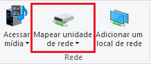
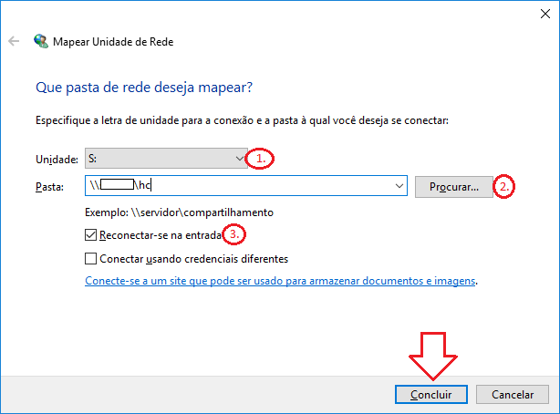
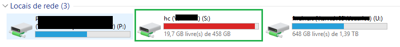

Making backups is important, but maintain them on your own terminal is not a smart move...

On this small tutorial you'll learn how to setup your backup to save it on a network drive

# Making backups from/to network on a Windows System

## Open My Computer and click on "Map Network Drive"

You can access this feture on the upper menu or clicking on right button of your mouse

## Check the configurations

1. Choose an unused drive letter
2. Type the network address. Ex: \\myserver\mybackups\
3. IMPORTANT. Keep "Reconnect on sig-in" marked, or you'll need to re-map anytime you login

## Check if the network is there

Open My Computer and check if the mapped drive is there.

## Done? Nooope! 

now you have a mapped Drive, check the tutorial [Scheduling a Windows Task](https://github.com/FRReinert/PyBackup/tree/master/example/task_manager/README.md) to learn how to schedule a backup system

Everything you'll need to do is change the **target_folder** to the drive you have mapped! 

