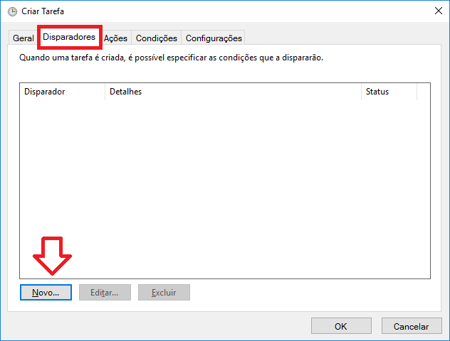

# Scheduling a backup task on Windows

At some point you gonna want to schedule your backup routines.

If so, this walktrough will help you with that...

## Setting up your script

1. Create a folder on your preference
2. Create your backup.py and settings.py file into this folder. My is looking like this:

3. Create a batch file, which looks like this
 

For more info about how to configure settings, [refer to this ling](https://github.com/FRReinert/PyBackup/blob/master/documentation/SETTINGS.md)

## Open your Task Manager and add a new task on the right menu

## Setup the relevant information

## Go to the trigger tab and hit new/add

## Setup as you prefer and hit OK

## Go to action tab and hit new/add action

## Point it to the .cmd file and set the location to the .cmd file (Important, set it right!)

## Done!

